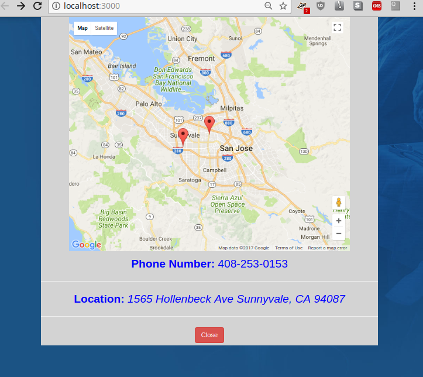

# <p align="center">DocDocGo</p>

#### <p align="center">By Evan Johnson</p>

## Description

_Enter a location and the specialty you require and a list of doctors in the given
proximity will appear_


***

***

## Setup/Installation Requirements

1. Chrome && Node
* ``` git clone https://github.com/evanjohnso/doc_doc_go.git ```
* ``` cd DocDocGo ```
* ```npm install ```
* Get an API key from [BetterDoctors](https://betterdoctor.com/developers/)
* Create .env file in root directory and save API key as:
```
  exports.apiKey = 'your_API_key_here';
```
* Run program ```gulp serve```


## Development Specifications
| Behavior      | Example Input         | Example Output        |
| ------------- | ------------- | ------------- |
| As a user I want to be able to enter an area and a specialty doctor | Seattle, WA && Dentist  |  15 doctors in your area!  |
| As a user I want to be able to see information about the doctor | Scroll over | If available, brief biography on doctor |
| As a user i want to be able to see a map of where the doctors office is | Click on details | Google Maps |

## Output Examples


## Technologies Used

* _JavaScript_
* _Node_
* _Gulp_
* _Postman_
* _Google Maps Geocoder_
* _Google Maps_
* _BetterDoctor API_

## Known Bugs
* If user enters New York and Dentist, the data returned is unable to be processed by the current code, need account for more variance in the JSON.
* Output of doctors is repeated, something wrong with the specialty doctor API call
* Reevaluate using try/catch block to handle API call errors versus native Ajax catch method


### License

MIT Copyright &copy; 2017 Evan Johnson
